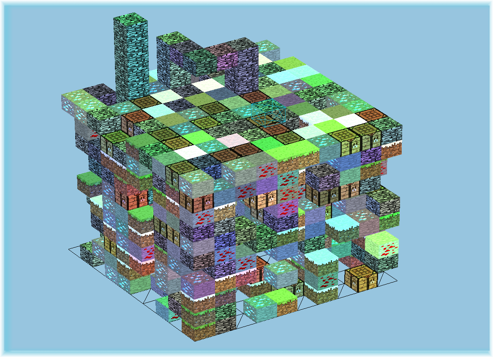
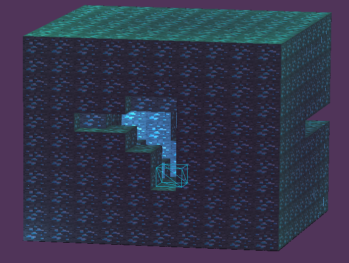
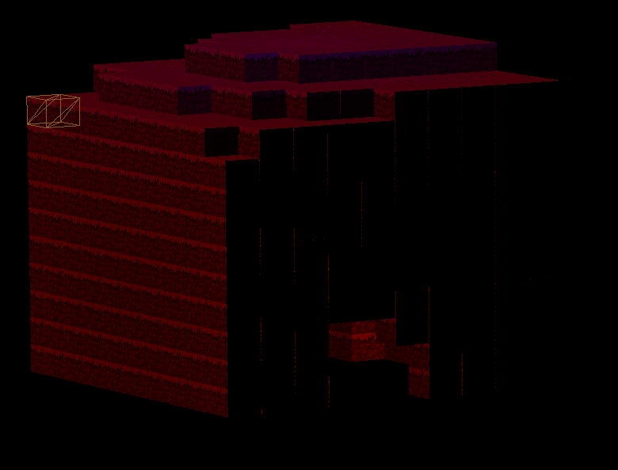

#World Imaker
##### Pierre THIEL et Yoann KOEPPEL

=====
### Dépendances :
* OpenGL 4.3
### Usage :
#### Création de l'exécutable :
    - mkdir build
    - cd build/
    - cmake ../
    - make 
#### Lancement :
    - bin/wim/world_imaker [largeur_du_monde] [longueur_du_monde]
### Interface utilisateur :

Cube :
* Ajout : 		      		[Inser]
* Suppression :	      		[Suppr]
* Creusement :	      		[ ! ]
* Extrusion :		      		[ : ]
* Changement texture :   		[TAB]
* Déplacement : 			[ESPACE] + [ENTRÉE]

Lumière (aléatoire) :
* Ajout ponctuelle : 	         	          [ p ]
* Ajout directionnelle :      	          [ m ]
* Suppression ponctuelle :	          [ 9 ]
* Suppression directionnelle :         [ 0 ]
* Allumage ambiante :		[ i ]
* Extinction ambiante :		[ o ]

Caméra :
* Rotation :			 	[SOURIS-BOUTON-MOLETTE] + [MOUVEMENT]
* Agrandissement :		 	[SOURIS-MOLETTE]

Génération :
* Aléatoire :                    [ n ]
* Ajout point de contrôle :				[ESPACE]
* Abandon point de contrôle : [RETOUR]
* Abandon tous points de contrôle : [ÉCHAP]
* Augmenter/abaisser poids point de contrôle : [FLÈCHE-HAUT]/[FLÈCHE-BAS]
* Procédurale : [[Sélection]] + [ * ]

### Captures d'écran :

==

